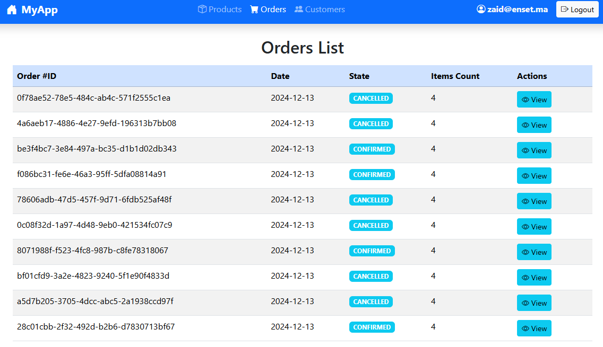
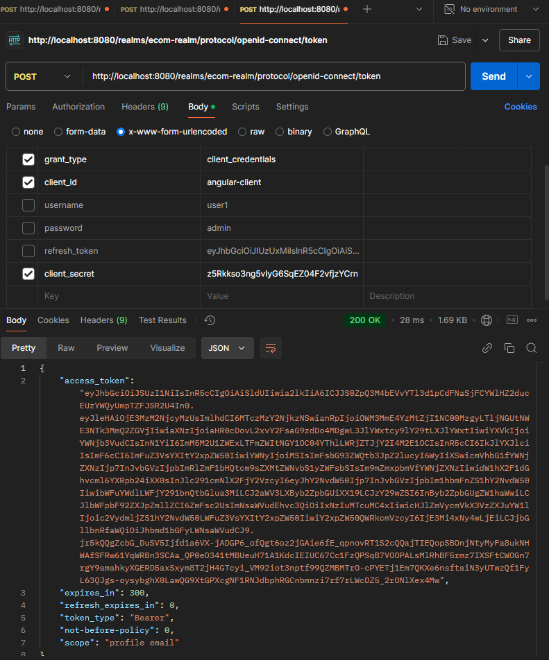

# Demo de Microservices avec Spring Boot et Keycloak OAuth2

Ce projet est une démonstration de l'utilisation de microservices avec Spring Boot et Keycloak pour la gestion de l'authentification OAuth2.

---

## Architecture du Projet

```
.
|- discover-service
|- gateway-service
|- config-server
|- inventory-service
|- order-service
|- frontend-angular
```

---

## Installation de Keycloak avec Docker

Pour simplifier l'installation, Keycloak sera déployé avec Docker.

```bash
# Télécharger l'image Keycloak
docker pull quay.io/keycloak/keycloak

# Lancer Keycloak
docker run --name mykeycloak -p 8080:8080 -e KEYCLOAK_ADMIN=admin -e KEYCLOAK_ADMIN_PASSWORD=admin quay.io/keycloak/keycloak:latest start-dev
```

- Pour plus de détails sur la configuration de Keycloak, consultez [ce dépôt GitHub](https://github.com/ELMOUADDIBE/old-demo-spring-oidc-keycloak).

### Configuration Spring Boot

Ajoutez cette dépendance pour activer l'utilisation d'OAuth2 :

```xml
<dependency>
    <groupId>org.springframework.boot</groupId>
    <artifactId>spring-boot-starter-oauth2-resource-server</artifactId>
</dependency>
```

Dans `application.properties`, configurez Keycloak :

```properties
spring.security.oauth2.resourceserver.jwt.issuer-uri=http://localhost:8080/realms/ecom-realm
spring.security.oauth2.resourceserver.jwt.jwk-set-uri=http://localhost:8080/realms/ecom-realm/protocol/openid-connect/certs
```

---

## Services

### Gateway Service

#### Dépendances

```xml
<dependency>
    <groupId>org.springframework.cloud</groupId>
    <artifactId>spring-cloud-starter-gateway</artifactId>
</dependency>
<dependency>
    <groupId>org.springframework.boot</groupId>
    <artifactId>spring-boot-starter-actuator</artifactId>
</dependency>
<dependency>
    <groupId>org.springframework.cloud</groupId>
    <artifactId>spring-cloud-starter-netflix-eureka-client</artifactId>
</dependency>
```

Ajoutez `@EnableDiscoveryClient` dans la classe principale.

### Discovery Service

#### Dépendances

```xml
<dependency>
    <groupId>org.springframework.cloud</groupId>
    <artifactId>spring-cloud-starter-netflix-eureka-server</artifactId>
</dependency>
<dependency>
    <groupId>org.springframework.boot</groupId>
    <artifactId>spring-boot-starter-actuator</artifactId>
</dependency>
```

Ajoutez les propriétés suivantes dans `application.properties` :

```properties
eureka.client.register-with-eureka=false
eureka.client.fetch-registry=false
```

Ajoutez `@EnableEurekaServer` dans la classe principale.

### Config Service

#### Dépendances

```xml
<dependency>
    <groupId>org.springframework.cloud</groupId>
    <artifactId>spring-cloud-config-server</artifactId>
</dependency>
<dependency>
    <groupId>org.springframework.boot</groupId>
    <artifactId>spring-boot-starter-actuator</artifactId>
</dependency>
```

Ajoutez `@EnableConfigServer` et `@EnableDiscoveryClient` dans la classe principale.

---

## Frontend Angular

Installez Keycloak Angular :

```bash
npm install keycloak-angular keycloak-js
```

### Interfaces Utilisateurs

1. **Login**


2. **Produits**


3. **Commandes**



---

## Tests avec Keycloak

### Swagger pour tester les APIs

Ajoutez cette dépendance dans votre projet Spring Boot :

```xml
<dependency>
    <groupId>org.springdoc</groupId>
    <artifactId>springdoc-openapi-starter-webmvc-ui</artifactId>
    <version>2.7.0</version>
</dependency>
```

Accédez à Swagger : [http://localhost:8081/swagger-ui/index.html](http://localhost:8081/swagger-ui/index.html)

### Test avec Postman

#### Token avec `password`

```http
POST http://localhost:8080/realms/ecom-realm/protocol/openid-connect/token
Content-Type: application/x-www-form-urlencoded
grant_type=password&client_id=angular-client&username=zaid&password=admin
```


#### Token avec `client_credentials`

Activez l'authentification du client dans Keycloak et testez :



---

## Instances et Résultats

### Instances

1. **Eureka Server** : [http://localhost:8761](http://localhost:8761)
   

2. **Frontend** : [http://localhost:4200](http://localhost:4200)

---

### Appels d'API

#### Appel pour l’authentification :

```http
POST http://localhost:8080/realms/ecom-realm/protocol/openid-connect/token
Content-Type: application/x-www-form-urlencoded
grant_type=password&client_id=angular-client&username=zaid&password=admin
```

```http
GET http://localhost:8081/api/auth
Authorization: Bearer <access-token>
```

#### Appel à l'API de produits :

```http
GET http://localhost:8888/INVENTORY-SERVICE/api/products
Authorization: Bearer <access-token>
```

#### Appel à l'API de commandes :

```http
GET http://localhost:8888/ORDER-SERVICE/api/orders
Authorization: Bearer <access-token>
```
